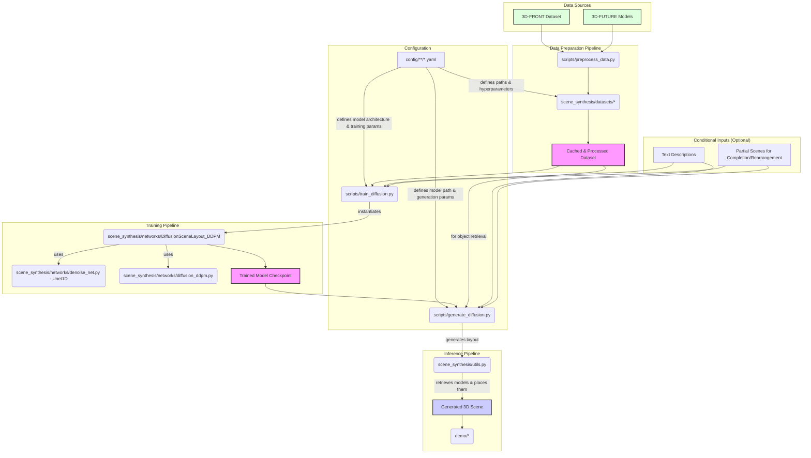

# DiffuScene System Diagram

This document outlines the architecture and data flow of the DiffuScene project.

## System Overview

The DiffuScene system is designed to generate 3D scenes using a diffusion model. The workflow is divided into three main stages: Data Preparation, Training, and Inference.

1.  **Data Preparation**: Raw 3D scene data from the 3D-FRONT and 3D-FUTURE datasets is processed by scripts in the `scripts/` directory. The core logic in `scene_synthesis/datasets/` handles filtering, splitting (using `.csv` files from `config/`), and encoding the scenes into a vectorized format (positions, sizes, classes, etc.). This processed data is cached for efficient use.

2.  **Training**: The training process is initiated by scripts like `scripts/train_diffusion.py`. These scripts use `.yaml` configuration files from the `config/` directory to define the model architecture, dataset, and hyperparameters. The central model, `DiffusionSceneLayout_DDPM`, uses a `Unet1D` as its denoising backbone. The model can be trained unconditionally or conditioned on inputs like text descriptions or partial scenes.

3.  **Inference (Generation)**: Scene generation is performed by scripts like `scripts/generate_diffusion.py`, which load a pre-trained model. The model generates a scene layout (object parameters like class, position, size). Utility functions in `scene_synthesis/utils.py` then retrieve corresponding 3D models from the dataset to construct the final 3D scene. The `demo/` directory contains example assets and outputs.

## Mermaid Diagram

