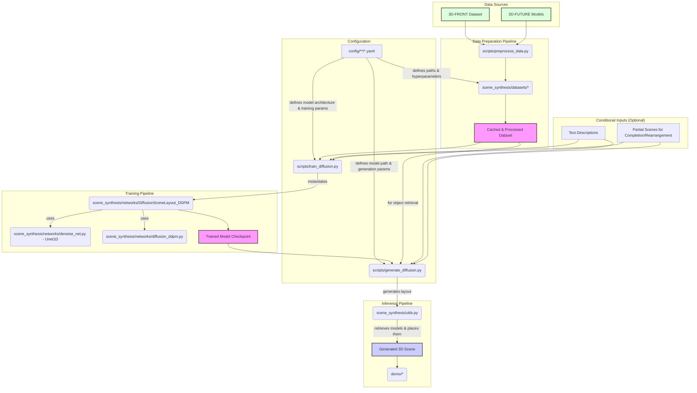
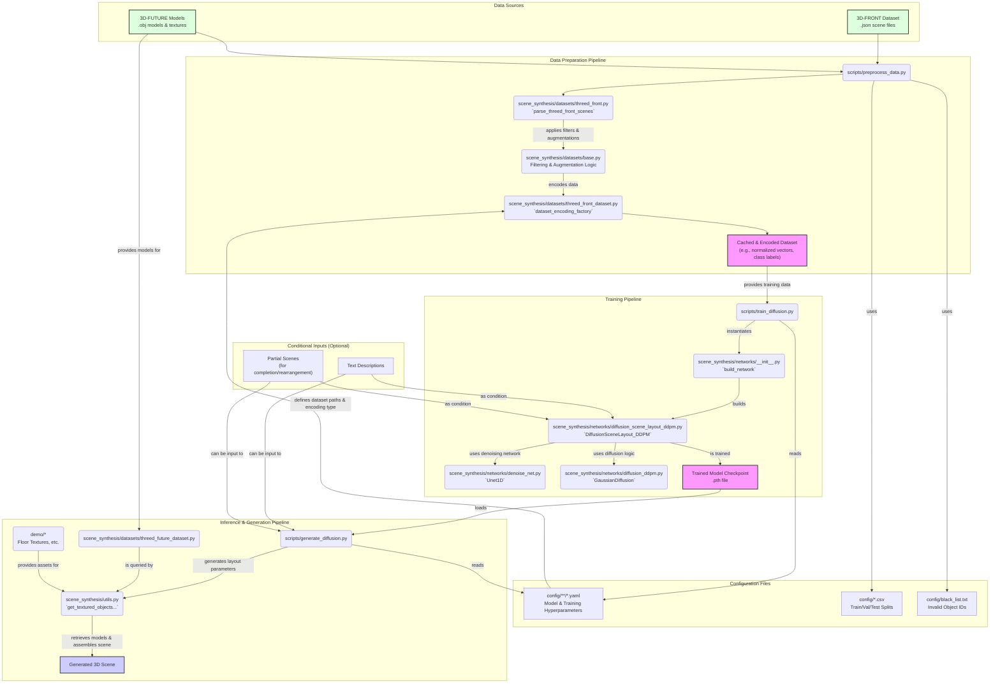

# DiffuScene System Diagram

This document outlines the architecture and data flow of the DiffuScene project.

## System Overview

The DiffuScene system is designed to generate 3D scenes using a diffusion model. The workflow is divided into three main stages: Data Preparation, Training, and Inference.

1.  **Data Preparation**: Raw 3D scene data from the 3D-FRONT and 3D-FUTURE datasets is processed by scripts in the `scripts/` directory. The core logic in `scene_synthesis/datasets/` handles filtering, splitting (using `.csv` files from `config/`), and encoding the scenes into a vectorized format (positions, sizes, classes, etc.). This processed data is cached for efficient use.

2.  **Training**: The training process is initiated by scripts like `scripts/train_diffusion.py`. These scripts use `.yaml` configuration files from the `config/` directory to define the model architecture, dataset, and hyperparameters. The central model, `DiffusionSceneLayout_DDPM`, uses a `Unet1D` as its denoising backbone. The model can be trained unconditionally or conditioned on inputs like text descriptions or partial scenes.

3.  **Inference (Generation)**: Scene generation is performed by scripts like `scripts/generate_diffusion.py`, which load a pre-trained model. The model generates a scene layout (object parameters like class, position, size). Utility functions in `scene_synthesis/utils.py` then retrieve corresponding 3D models from the dataset to construct the final 3D scene. The `demo/` directory contains example assets and outputs.

## Mermaid Diagram




## Detailed Mermaid Diagram



```
╭─────────────────────────────────────────────────────────────────────────────────────────────────────────────────────────────────────────────────────────────╮
│  > @scripts/generate_diffusion.py If I want to do some qualitative scene generation experiments in Jupyter notebook, what is your recommendation in terms  │
│    of what to make the entrypoint? (Should I call this script via CLI? Run main()? Run some of the underlying functions? ...)                              │
╰─────────────────────────────────────────────────────────────────────────────────────────────────────────────────────────────────────────────────────────────╯

 ╭───────────────────────────────────────────────────────────────────────────────────────────────────────────────────────────────────────────────────────────╮
 │ ✔  ReadManyFiles Will attempt to read and concatenate files using patterns: `scripts/generate_diffusion.py` (within target directory: `/home/ycho358/Gi…  │
 │                                                                                                                                                           │
 │    ### ReadManyFiles Result (Target Dir: `/home/ycho358/GitHub/DiffuScene`)                                                                               │
 │                                                                                                                                                           │
 │    Successfully read and concatenated content from **1 file(s)**.                                                                                         │
 │                                                                                                                                                           │
 │    **Processed Files:**                                                                                                                                   │
 │    - `scripts/generate_diffusion.py`                                                                                                                      │
 ╰───────────────────────────────────────────────────────────────────────────────────────────────────────────────────────────────────────────────────────────╯
✦ For interactive experiments in a Jupyter notebook, I recommend extracting the core scene generation logic from the main function into a separate, reusable
  function.

  Calling the script via the command line (!python ...) or even calling main() directly from the notebook is not ideal for interactive use, because you would
  have to re-run the entire setup (loading models, datasets, etc.) for every small change.

  Here is a more flexible approach:

  Recommendation: Create a Reusable generate_scene Function

  The idea is to separate the one-time setup (loading models and data) from the scene generation logic, which you might want to run many times with different
   parameters.

  Here’s how you can set it up in your Jupyter notebook:

  Step 1: Initial Setup

  In the first cell of your notebook, place all the necessary imports and the one-time setup code to load the configuration, datasets, and the pre-trained
  network. You'll need to replace the placeholder paths with the actual paths to your files.

    1 # Step 1: Imports and setup
    2 import torch
    3 import numpy as np
    4 import logging
    5 import os
    6 
    7 # Make sure you are in the 'scripts' directory or adjust paths accordingly
    8 # os.chdir('/path/to/your/project/scripts')
    9 
   10 # Import functions from the project
   11 from training_utils import load_config
   12 from utils import floor_plan_from_scene, get_textured_objects_based_on_objfeats, get_textured_objects
   13 from scene_synthesis.datasets import filter_function, get_dataset_raw_and_encoded
   14 from scene_synthesis.datasets.threed_future_dataset import ThreedFutureDataset
   15 from scene_synthesis.networks import build_network
   16 
   17 # Disable trimesh's logger
   18 logging.getLogger("trimesh").setLevel(logging.ERROR)
   19 
   20 # Step 2: Set parameters (REPLACE WITH YOUR PATHS)
   21 config_file = "../config/uncond/diffusion_bedrooms_instancond_lat32_v.yaml"  # Example
   22 # IMPORTANT: Set the path to your pre-trained model weights
   23 weight_file = None # e.g., "../pretrained/bedrooms_uncond.pth" 
   24 # IMPORTANT: Set the path to your pickled 3D-FUTURE models
   25 path_to_pickled_3d_futute_models = "../demo/threed_future_models.pkl"
   26 path_to_floor_plan_textures = "../demo/floor_plan_texture_images"
   27 
   28 # Step 3: Initialize device, config, datasets, and network
   29 device = torch.device("cuda:0" if torch.cuda.is_available() else "cpu")
   30 print("Running code on", device)
   31 
   32 config = load_config(config_file)
   33 
   34 # Modify config for evaluation as in the original script
   35 if 'text' in config["data"]["encoding_type"] and 'textfix' not in config["data"]["encoding_type"]:
   36     config["data"]["encoding_type"] = config["data"]["encoding_type"].replace('text', 'textfix')
   37 if "no_prm" not in config["data"]["encoding_type"]:
   38     print('NO PERM AUG in test')
   39     config["data"]["encoding_type"] += "_no_prm"
   40 print('Encoding type:', config["data"]["encoding_type"])
   41 
   42 # Load datasets
   43 raw_dataset, dataset = get_dataset_raw_and_encoded(
   44     config["data"],
   45     filter_fn=filter_function(
   46         config["data"],
   47         split=config["validation"].get("splits", ["test"])
   48     ),
   49     split=config["validation"].get("splits", ["test"])
   50 )
   51 objects_dataset = ThreedFutureDataset.from_pickled_dataset(
   52     path_to_pickled_3d_futute_models
   53 )
   54 print(f"Loaded {len(dataset)} scenes and {len(objects_dataset)} 3D models.")
   55 
   56 # Build and load network
   57 network, _, _ = build_network(
   58     dataset.feature_size, dataset.n_classes,
   59     config, weight_file, device=device
   60 )
   61 network.eval()
   62 
   63 print("\nSetup complete. You can now use the generate_scene() function in the next cells.")

  Step 2: Define the Generation Function

  In a new cell, define a function that encapsulates the logic for generating a single scene. This function takes all the necessary objects and parameters,
  making it easy to call interactively.

    1 def generate_scene(
    2     network,
    3     dataset,
    4     raw_dataset,
    5     objects_dataset,
    6     config,
    7     device,
    8     scene_idx,
    9     path_to_floor_plan_textures,
   10     clip_denoised=False,
   11     retrive_objfeats=False,
   12     no_texture=False,
   13     without_floor=False,
   14     seed=0
   15 ):
   16     """Generates a single scene based on the provided index and parameters."""
   17     current_scene = raw_dataset[scene_idx]
   18     samples = dataset[scene_idx]
   19     print(f"Using floor plan from scene {current_scene.scene_id} (index {scene_idx})")
   20 
   21     # Get a floor plan
   22     floor_plan, tr_floor, room_mask = floor_plan_from_scene(
   23         current_scene, path_to_floor_plan_textures, no_texture=no_texture
   24     )
   25 
   26     # Generate layout
   27     bbox_params = network.generate_layout(
   28             room_mask=room_mask.to(device),
   29             num_points=config["network"]["sample_num_points"],
   30             point_dim=config["network"]["point_dim"],
   31             text=samples.get('description'),
   32             device=device,
   33             clip_denoised=clip_denoised,
   34             batch_seeds=torch.arange(seed, seed + 1),
   35     )
   36 
   37     boxes = dataset.post_process(bbox_params)
   38     bbox_params_t = torch.cat([
   39         boxes["class_labels"],
   40         boxes["translations"],
   41         boxes["sizes"],
   42         boxes["angles"]
   43     ], dim=-1).cpu().numpy()
   44 
   45     # Retrieve 3D models
   46     classes = np.array(dataset.class_labels)
   47     if retrive_objfeats:
   48         objfeats = boxes["objfeats"].cpu().numpy()
   49         renderables, trimesh_meshes, _ = get_textured_objects_based_on_objfeats(
   50             bbox_params_t, objects_dataset, classes, diffusion=True, no_texture=no_texture, query_objfeats=objfeats,
   51         )
   52     else:
   53         renderables, trimesh_meshes, _ = get_textured_objects(
   54             bbox_params_t, objects_dataset, classes, diffusion=True, no_texture=no_texture
   55         )
   56 
   57     if not without_floor:
   58         renderables += floor_plan
   59         trimesh_meshes += tr_floor
   60 
   61     return renderables, trimesh_meshes

  Step 3: Interactive Generation and Visualization

  Now, you can call generate_scene in another cell to generate and visualize scenes. You can easily change parameters like scene_idx, clip_denoised, or the
  seed and re-run the cell to see new results.

    1 # Make sure you have installed the visualization library, e.g., pip install simple-3dviz
    2 from simple_3dviz import Scene
    3 from simple_3dviz.window import show
    4 from simple_3dviz.behaviours.movements import CameraTrajectory
    5 from simple_3dviz.behaviours.trajectory import Circle
    6 
    7 # --- Parameters for generation ---
    8 scene_idx_to_generate = 25  # Change this to generate from a different floor plan
    9 generation_seed = np.random.randint(1000) # Change this for different random results
   10 
   11 renderables, trimesh_meshes = generate_scene(
   12     network=network,
   13     dataset=dataset,
   14     raw_dataset=raw_dataset,
   15     objects_dataset=objects_dataset,
   16     config=config,
   17     device=device,
   18     scene_idx=scene_idx_to_generate,
   19     path_to_floor_plan_textures=path_to_floor_plan_textures,
   20     clip_denoised=True,
   21     seed=generation_seed
   22 )
   23 
   24 # --- Visualize the generated scene ---
   25 scene = Scene(size=(768, 768), background=(1, 1, 1, 1))
   26 scene.add_many(renderables)
   27 
   28 # Use camera settings from the script for a good default view
   29 scene.camera_position = (-0.1, 1.9, -7.2)
   30 scene.camera_target = (0, 0, 0)
   31 scene.up_vector = (0, 1, 0)
   32 
   33 # Optional: Add a rotating camera for better inspection
   34 scene.add_behaviour(CameraTrajectory(
   35     Circle(center=(0, 0, 0), point=(0, 2.5, -8), normal=(0, 1, 0)),
   36     speed=0.005
   37 ))
   38 
   39 # This will open a window to display the scene
   40 show(scene)

  This approach provides a clean and interactive workflow for your experiments directly within the notebook.
```

```
╭───────────────────────────────────────────────────────────────────────────────────────────────╮
│  > How easy do you think it would be to convert this project into a pip-installable package?  │
╰───────────────────────────────────────────────────────────────────────────────────────────────╯

✦ Based on the project structure, converting this project into a pip-installable package is moderately complex. It's not a simple, straightforward task,
  but it's definitely achievable.

  Here's a breakdown of the "easy" parts and the "hard" parts:

  The Good News (The "Easy" Parts)

   * `setup.py` already exists: The presence of a setup.py file is a great starting point. It shows that the original authors likely had packaging in mind,
     even if just for local development (pip install -e .).
   * Clear Source Directory: The core logic is well-organized inside the scene_synthesis/ directory, which acts as a Python package (due to __init__.py).
     This is standard practice.
   * Conda Environment File: The environment.yaml file provides a nearly complete list of dependencies. This is much better than having to hunt for them
     manually.

  The Key Challenges (The "Hard" Parts)

   1. Custom C++/CUDA Extensions: This is the biggest challenge. The ChamferDistancePytorch directory contains custom C++ and CUDA code that needs to be
      compiled during installation.
       * The setup.py files within chamfer2D/, chamfer3D/, and chamfer5D/ handle this compilation.
       * Making this work seamlessly with pip install requires careful configuration in the main setup.py. The installer will need the correct CUDA toolkit
         and a C++ compiler (like g++) available on the user's machine. This makes the package platform-specific (likely Linux-only) and hardware-specific
         (requires an NVIDIA GPU with the right CUDA version).

   2. Dependencies (`environment.yaml` vs. `pip`):
       * Conda and Pip handle dependencies differently. Some packages in environment.yaml might come from Conda-Forge and not have direct equivalents on
         PyPI.
       * Crucially, dependencies like pytorch and cudatoolkit are tricky. You can't just list pytorch in install_requires. You typically have to instruct
         the user to install PyTorch first, following the official instructions to match their CUDA version.

   3. Non-Code Data: The package relies on data that doesn't belong in a pip package, such as:
       * config/: Configuration files.
       * pretrained/: Large pre-trained model weights.
       * demo/: Demo assets and data.
      A robust package would need a mechanism to download these files on-demand after installation, rather than bundling them.

  Path Forward: A Step-by-Step Plan

  If you want to proceed, here is the path I would recommend:

   1. Analyze Existing `setup.py` and `environment.yaml`: I'll start by reading these files to understand the current setup and dependencies.

 ╭───────────────────────────────────────────────────────────────────────────────────────────────────────────────────────────────────────────────────────────╮
 │ ✔  ReadManyFiles Will attempt to read and concatenate files using patterns: `/home/ycho358/GitHub/DiffuScene/setup.py`, `/home/ycho358/GitHub/DiffuScen…  │
 │                                                                                                                                                           │
 │    ### ReadManyFiles Result (Target Dir: `/home/ycho358/GitHub/DiffuScene`)                                                                               │
 │                                                                                                                                                           │
 │    Successfully read and concatenated content from **2 file(s)**.                                                                                         │
 │                                                                                                                                                           │
 │    **Processed Files:**                                                                                                                                   │
 │    - `environment.yaml`                                                                                                                                   │
 │    - `setup.py`                                                                                                                                           │
 ╰───────────────────────────────────────────────────────────────────────────────────────────────────────────────────────────────────────────────────────────╯
✦ After reviewing the files, here's a more concrete plan:

   1. Modify `setup.py`:
       * Dependencies: I will replace the hardcoded get_install_requirements() with a function that parses environment.yaml to create a more accurate
         install_requires list. I will need to handle the pip-specific packages as well.
       * CUDA Extensions: The get_extensions() function is currently empty. I will modify it to properly discover and build the Chamfer distance
         extensions. This will involve using PyTorch's CUDAExtension builder.
       * Metadata: The collect_metadata function is a good start. I will ensure it extracts all the necessary information (version, author, etc.) and
         populates the setup() call correctly.

   2. Handle Data Files:
       * For the config files, I will use the package_data argument in setup() to include them in the package.
       * For the larger pretrained and demo assets, the best practice is to not include them in the package. I will add a post-installation script or a
         utility function within the package to download these assets from a remote location (like a GitHub release or a cloud storage bucket).

   3. Refine `environment.yaml`: I will clean up this file to better separate the build-time dependencies (like cython, pytorch-cuda) from the runtime
      dependencies.

  This is a significant undertaking. Would you like me to start by modifying the setup.py file to handle the dependencies and the CUDA extensions? This
  would be the most critical first step.
```
